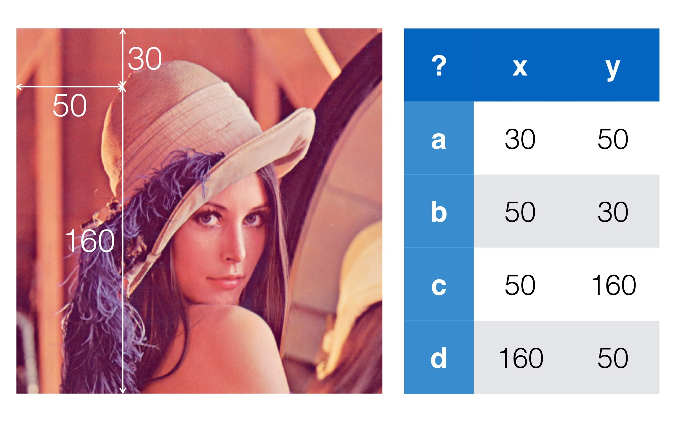

.. _ug-consistency:

Working with Images and PointClouds
===================================
Menpo takes an opinionated stance on certain issues - one of which is
establishing sensible rules for how to work with spatial data and image data
in the same framework.

Let's start with a quiz - which of the following is correct?

Most would answer **b** - images are indexed from the top left, with ``x`` going
across and ``y`` going down.

Now another question - how do I access that pixel in the pixels array? ::

    a: lenna[30, 50]
    b: lenna[50, 30]

The correct answer is **b** - pixels get stored in a `y, x` order so we have to
flip the points to access the array.

As Menpo blends together use of PointClouds and Images frequently this can
cause a lot of confusion. You might create a :map:`Translation` of ``5`` in the
``y`` direction as the following::

    t = menpo.transform.Translation([0, 5])

And then expect to use it to warp an image::

     img.warp_to(reference_shape, t)

and then some spatial data related to the image::

    t.apply(some_data)

Unfortunately the meaning of ``y`` in these two domains is different - some
code would have to flip the order of applying the translation of the transform
to an image, a potential cause of confusion.

The *worst* part about this is that once we go to voxel data (which
:map:`Image` largely supports, and will fully support in the future), a z-axis
is added.
Now we drop all the swapping business - and the third axis of the spatial
data once more corresponds with the third axis of the image data. Trying to
keep track of these rules muddies an otherwise very simple concept.

Menpo's approach
----------------
Menpo's solution to this problem is simple - **drop the insistence of calling
axes x, y, and z**. The zeroth axis of the pixel data is simply that - the
zeroth axis. It corresponds exactly with the zeroth axis on the point cloud.
If you have an image with annotations provided the zeroth axis of the
`PointCloud` representing the annotations will correspond with the zeroth
axis of the image. This rule makes working with images and spatial data simple -
short you should never have to think about flipping axes in Menpo.

It's natural to be concerned at this point that establishing such rules must
make it really difficult ingest data which follows different conventions. This
is incorrect - one of the biggest strengths of the :ref:`api-io-index` module
is that each asset importer normalizes the format of the data to format Menpo's
rules.

Key Points
----------
- **Menpo is n-dimensional**. We try and avoid speaking of ``x`` and ``y``,
  because there are many different conventions in use.

- **The IO module ensures that different data formats are normalized** upon
  loading into Menpo. For example, :map:`Image` types are imported as 64-bit
  floating point numbers normalised between [0, 1], by default.

- **axis 0 of landmarks corresponds to axis 0 of the container it is an annotation of**.
