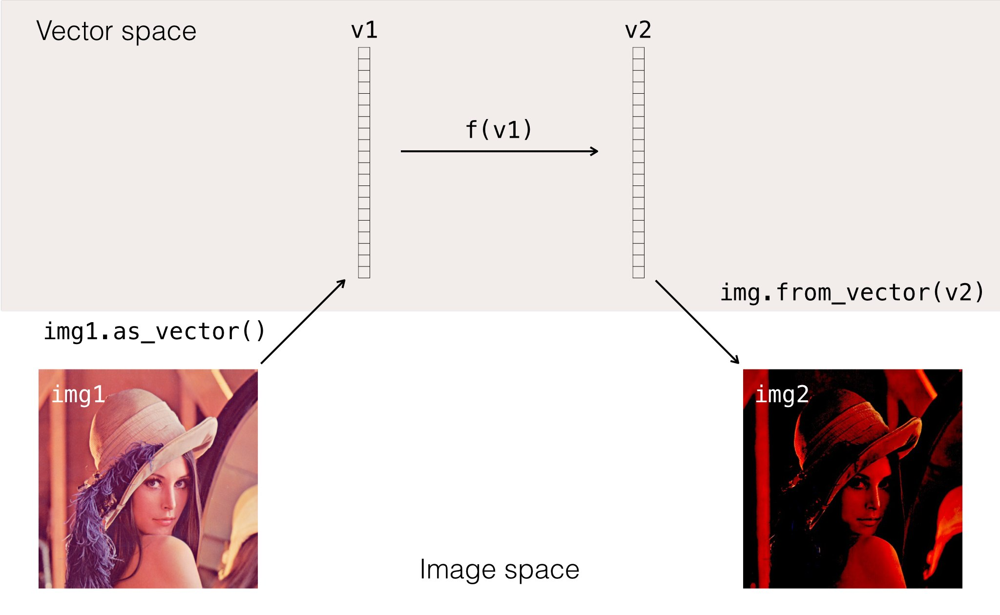

.. _ug-vectorizing:

Vectorizing Objects
===================

   **Figure 1:** `Vectorizing allows Menpo to have rich data types whilst
   simultaneously providing efficient linear algebra routines. Here an image is
   vectorized, and an arbitrary process` ``f()`` `is performed on it's vector
   representation. Afterwards the vector is converted the back into an image.
   The vector operation is completely general, and could have equally been
   performed on some spatial data.`

Computer Vision algorithms are frequently formulated as linear algebra problems
in a high dimensional space, where each asset is stripped into a vector.
In this high dimensional space we may perform any number of operations,
but normally we can't stay in this space for the whole algorithm - we normally
have to recast the vector back into it's original domain in order to perform
other operations.

An example of this might be seen with images, where the gradient of the
intensity values of an image needs to be taken. This is a complex problem to
solve in a vector space representation of the image, but trivial to solve in the
image domain.

Menpo bridges the gap by naively supporting bi-directional vectorisation of
it's types through the :map:`Vectorizable` interface. Through this, any type can
be safely and efficiently converted to a vector form and back again. You'll find
the key methods of :map:`Vectorizable` are extensively used in Menpo. They are

- :map:`as_vector` - generate a vector from one of our types.
- :map:`from_vector` - rebuild one of our types from a vector
- :map:`from_vector_inplace` - alter an object inplace to take on the new state

Key points
----------
1. **Each type defines it's own form of vectorization**. Calling
:map:`as_vector` on a :map:`Image` returns all of the pixels in a single strip,
whilst on a :map:`MaskedImage` only the true pixels are returned. This
distinction means that much of Menpo's image algorithms work equally well with
masked or unmasked data - it's the :map:`Vectorizable` interface that abstracts
away the difference between the two.

2. **Lots of things are vectorizable, not just images.** Pointclouds and
lots of transforms are too.

3. **The length of the resulting vector of a type can be found by querying the
``n_parameters`` property.**

4. **The vectorized form of an object does not have to be 'complete'.**
:map:`from_vector` and :map:`from_vector_inplace` can use the object they are
called on to rebuild a complete state. Think of vectorization more as a
``parametrization`` of the object, not a complete serialization.
